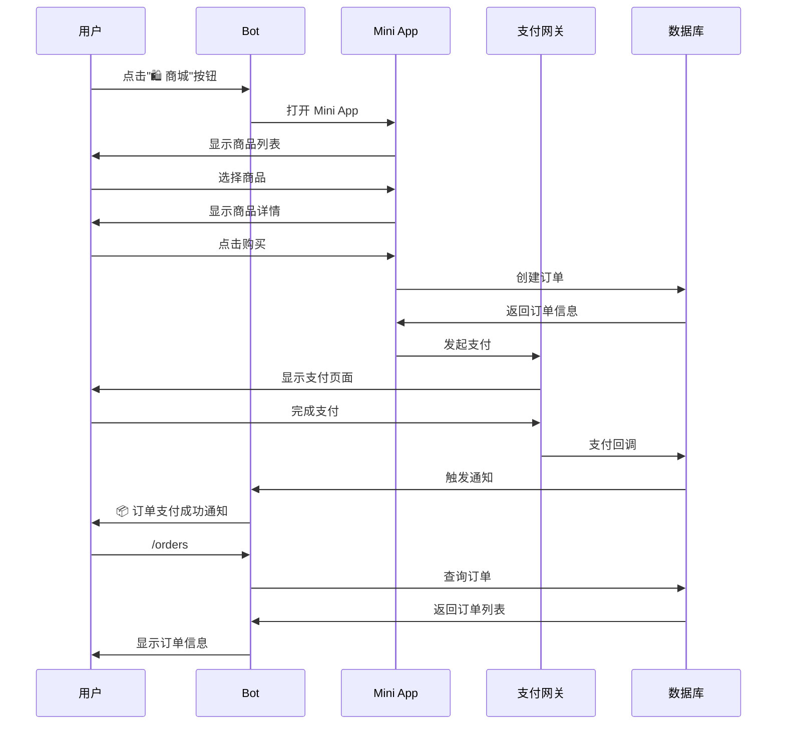
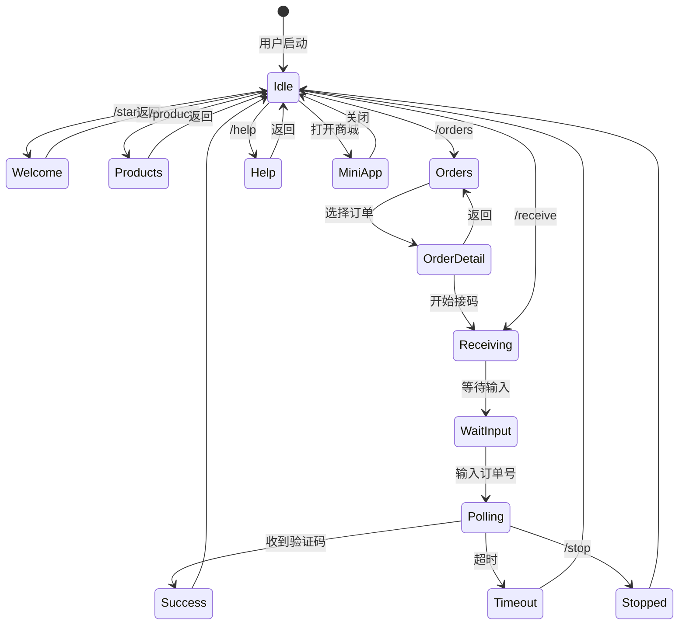

# SimpleFaka Telegram Bot 完整方案 (续)

## 📊 用户操作流程 (续)

### 2. 接码流程详细图 (续)

```mermaid
sequenceDiagram
    participant U as 用户
    participant B as Telegram Bot
    participant S as 接码服务
    participant API as 上游API
    
    U->>B: /receive
    B->>U: 请输入订单号
    U->>B: 输入订单号
    
    B->>S: 验证订单号
    alt 订单有效
        S->>B: 验证通过
        B->>U: ⏳ 开始监听...loop 每5秒轮询(最多60次)
            B->>API: 查询短信
            alt 收到短信
                API->>B: 返回验证码
                B->>U: ✅ 显示验证码
                B->>S: 清理会话
            else 未收到
                B->>U: 更新进度 (n/60)
            end
        end
        
        alt 超时
            B->>U: ⏱️ 超时提示
            B->>S: 清理会话
        end
    else 订单无效
        S->>B: 验证失败
        B->>U: ❌ 订单号无效
    end
```

### 3. 购物流程详细图



### 4. 命令交互状态图



---

## 🎨 功能模块设计

### 模块 1：命令系统

#### 1.1 基础命令

| 命令 | 功能 | 状态 | 优先级 |
|------|------|------|--------|
| `/start` | 欢迎信息和主菜单 | ✅ 已实现 | P0 |
| `/help` | 帮助信息 | ✅ 已实现 | P0 |
| `/products` | 商品列表 | ✅ 已实现 | P1 |
| `/orders` | 我的订单 | 🚧 部分实现 | P0 |
| `/receive` | 接码终端 | ✅ 已实现 | P0 |
| `/stop` | 停止接码 | ✅ 已实现 | P1 |

#### 1.2 高级命令（待开发）

| 命令 | 功能 | 优先级 |
|------|------|--------|
| `/search <关键词>` | 搜索商品 | P2 |
| `/balance` | 查询余额 | P1 |
| `/history` | 历史记录 | P2 |
| `/settings` | 个人设置 | P2 |
| `/support` | 联系客服 | P1 |

### 模块 2：接码系统

#### 2.1 核心功能

```
接码流程：
1. 用户输入订单号
2. 验证订单有效性
3. 启动轮询机制
4. 实时更新状态
5. 推送验证码
6. 清理会话
```

#### 2.2 技术特性

- **轮询策略**：5秒间隔，最多60次（5分钟）
- **会话管理**：内存存储，支持并发
- **状态更新**：实时编辑消息显示进度
- **错误处理**：超时、无效订单、网络异常

#### 2.3 优化方向

- [ ] 智能轮询：根据历史数据动态调整间隔
- [ ] 会话持久化：支持 Bot 重启后恢复
- [ ] 并发控制：限制单用户同时接码数量
- [ ] 推送优化：使用 Webhook 替代轮询

### 模块 3：订单管理

#### 3.1 功能清单

- [x] 订单列表查询
- [ ] 订单详情展示
- [ ] 卡密信息显示
- [ ] 订单状态追踪
- [ ] 订单历史记录

#### 3.2 数据展示

```
订单信息卡片：
┌─────────────────────────┐
│ 📦 订单 #12345          │
├─────────────────────────┤
│ 商品：中国手机号(5分钟) │
│ 状态：✅ 已完成          │
│ 金额：¥2.50             │
│ 时间：2026-03-13 23:30  │
├─────────────────────────┤
│ [查看卡密] [开始接码]    │
└─────────────────────────┘
```

### 模块 4：Mini App 商城

#### 4.1 功能模块

```
Mini App 结构：
├── 首页
│   ├── 商品分类
│   ├── 热门商品
│   └── 搜索功能
├── 商品详情
│   ├── 商品信息
│   ├── 价格说明
│   └── 购买按钮
├── 购物车
│   ├── 商品列表
│   ├── 数量调整
│   └── 结算功能
├── 订单管理
│   ├── 订单列表
│   ├── 订单详情
│   └── 卡密查看
└── 个人中心
    ├── 用户信息
    ├── 余额管理
    └── 设置选项
```

#### 4.2 集成方案

- **身份验证**：通过 Telegram Web App SDK 获取用户信息
- **数据同步**：Bot 与 Mini App 共享用户会话
- **支付集成**：支持多种支付方式
- **状态通知**：订单状态变更推送到 Bot

### 模块 5：用户管理

#### 5.1 用户数据模型

```typescript
interface TelegramUser {
  telegram_id: number        // Telegram 用户 ID
  username?: string          // 用户名
  first_name: string         // 名字
  last_name?: string         // 姓氏
  language_code?: string     // 语言代码
  created_at: Date           // 注册时间
  last_active: Date          // 最后活跃时间
}
```

#### 5.2 功能清单

- [ ] 用户注册和绑定
- [ ] 用户信息存储
- [ ] 会话管理
- [ ] 偏好设置
- [ ] 活跃度统计